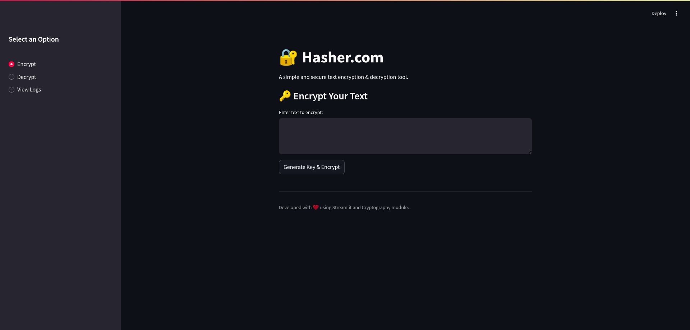

# HASHER

## Objective

The HASHER project aimed to establish a End-to-End Encrypt Message environment for Encrypted and Secure Messages. The primary focus was to increase the Privacy of the user.

### Skills Learned
- Advanced understanding of Python concepts.
- Proficiency in analyzing and interpreting Cryptography.
- Ability to generate and recognize attack signatures and patterns.
- Enhanced knowledge of Streamlit.
- Development of critical thinking and problem-solving skills in cyber security.

### Tools Used
- Python.
- Cryptography: A Python Library.
- Streamlit for User Interface.

## Requirements
1. Python
2. Cryptography Module
3. Streamlit

## Installation
```bash
pip3 install -r requirements.txt
streamlit run hasher
```

*Ref 1: Hasher*

